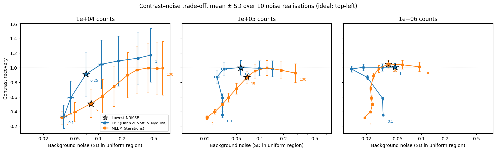

# Count-Level Effects in Emission Tomography Reconstruction: FBP vs MLEM

<!-- One sentence: what question this project answers. -->
How does the number of detected counts affect image quality when reconstructing simulated 2D PET data with filtered back-projection (FBP) versus maximum-likelihood expectation maximisation (MLEM)?


<!-- Replace with your single most informative figure, e.g. the contrast–noise curves. -->

## Key findings

<!-- 2–4 bullets with real numbers, written last. Example format only: -->
- At 10⁴ counts, MLEM reduced NRMSE by **[X ± Y]%** relative to the best FBP filter (10 noise realisations).
- At 10⁶ counts, the two methods differed by **[Z]%**, i.e. [interpretation].
- MLEM noise increased with iteration number; the best contrast–noise trade-off occurred at **[N]** iterations.

## Background

<!-- 1 short paragraph each. Cite sources. -->
- **PET and count statistics:** positron annihilation, coincidence detection, lines of response; detected counts follow a Poisson distribution, so relative noise scales as 1/√N.
- **FBP:** analytic inversion of the Radon transform; fast, but does not model Poisson noise.
- **MLEM:** iterative algorithm that maximises the Poisson likelihood (Shepp & Vardi, 1982).

## Method

### Simulation
| Parameter | Value |
|---|---|
| Phantom | Shepp–Logan, [128 × 128] pixels |
| Projection angles | [180] over 0–180° |
| Total counts | 10⁴, 10⁵, 10⁶ |
| Noise | Poisson, applied to the scaled sinogram |
| Noise realisations | [10] per condition |
| Random seed(s) | [list] |

### Reconstruction
- **FBP:** `skimage.transform.iradon` with filters [ramp, hann, ...].
- **MLEM:** implemented from scratch in NumPy (`src/mlem.py`), update rule:

  x⁽ᵏ⁺¹⁾ = x⁽ᵏ⁾ / (Aᵀ1) · Aᵀ( y / (A x⁽ᵏ⁾) )

  where A is forward projection (`radon`) and Aᵀ is unfiltered back-projection.
- **Validation:** on noise-free data, MLEM error decreased monotonically with iteration ([figure link]).

### Evaluation metrics
- **NRMSE** against the ground-truth phantom
- **Contrast recovery** in [describe hot region]
- **Background noise:** standard deviation in [describe uniform region]

## Results

<!-- Table + 2–3 figures, each with a one-sentence takeaway underneath. -->
| Counts | Method | Setting | NRMSE (mean ± SD) | Contrast recovery | Noise |
|---|---|---|---|---|---|
| 10⁴ | FBP | ramp | | | |
| 10⁴ | MLEM | [N] iter | | | |
| ... | | | | | |


*[One-sentence takeaway.]*


*[One-sentence takeaway.]*

## Limitations

- 2D simulation only; real PET is 3D.
- No attenuation, scatter, random coincidences or detector response modelled.
- Unfiltered `iradon` is used as an approximate adjoint of `radon`.
- Single synthetic phantom; results may not generalise to clinical images.

## Reproducing the results

```bash
git clone https://github.com/[username]/[repo].git
cd [repo]
pip install -r requirements.txt
```
Or open `notebooks/main.ipynb` in Google Colab and select **Runtime → Run all**.
Expected runtime: ~[X] minutes on a Colab CPU.

## Repository structure

```
├── notebooks/
│   └── main.ipynb        # full pipeline: simulation → reconstruction → figures
├── src/
│   ├── mlem.py           # MLEM implementation
│   └── metrics.py        # NRMSE, contrast, noise
├── figures/              # generated plots
├── requirements.txt
└── README.md
```

## References

1. Shepp, L. A. & Vardi, Y. (1982). Maximum likelihood reconstruction for emission tomography. *IEEE Transactions on Medical Imaging*, 1(2), 113–122.
2. Bruyant, P. P. (2002). Analytic and iterative reconstruction algorithms in SPECT. *Journal of Nuclear Medicine*, 43(10), 1343–1358.
3. [Any tutorial or code you drew on: credit it here.]

## Author

[Your name]: BEng Biomedical Engineering, UCL · [email / LinkedIn]
