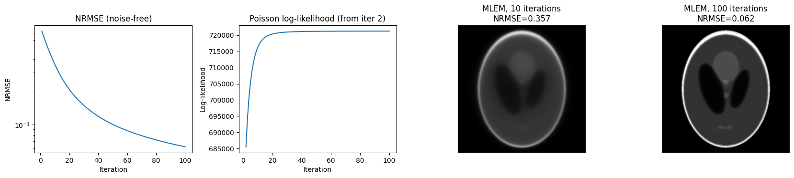
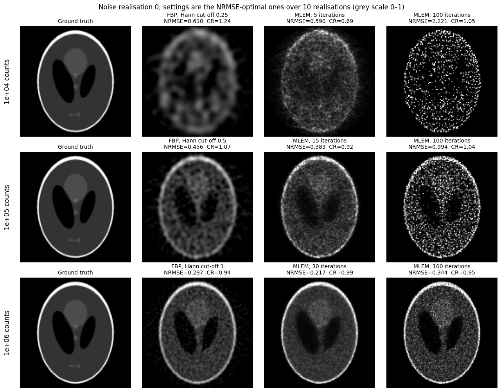
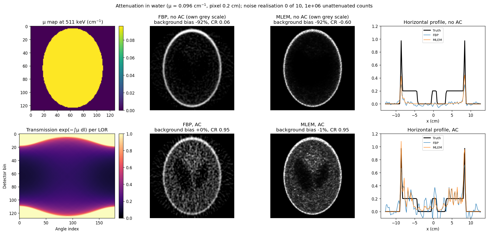

# Count-Level Effects in Emission Tomography Reconstruction: FBP vs MLEM

## Disclaimer: AI is used to assist authors in implementing MLEM from scratch and coding revision and refining.

How does the number of detected counts affect image quality when reconstructing simulated 2D PET data with filtered back-projection (FBP) versus maximum-likelihood expectation maximisation (MLEM)?

Two extensions put the count levels in physical context: photon attenuation in water with and without attenuation correction, and the radioactive decay, patient dose and counts of a standard versus a half-dose ¹⁸F-FDG scan.


*Contrast recovery against background noise, mean ± SD over 10 noise realisations. Each curve sweeps one method's parameter: Hann cut-off for FBP, iteration number for MLEM. Stars mark the setting with the lowest NRMSE. At 10⁴ counts MLEM's NRMSE-optimal image keeps only half the contrast; at 10⁶ counts MLEM reaches full contrast at lower noise than FBP. The leftward hook of the FBP curves at the lowest cut-offs is blur leaking into the background region, not noise (see Limitations).*

## Key findings
- MLEM's advantage over FBP grows with count level. MLEM lowered NRMSE by 2.8% at 10⁴ counts, 15% at 10⁵ and 29% at 10⁶ (paired differences −0.017 ± 0.004, −0.068 ± 0.004 and −0.085 ± 0.003). MLEM was better in 10 of 10 realisations at every level.
- At 10⁴ counts, MLEM's lower NRMSE does not mean a better image. Its NRMSE-optimal setting (5 iterations) recovered only 51% of the hot-region contrast, against 91% for the best FBP.
- **The optimal MLEM iteration number increases with counts: 5, 15 and 30 iterations** at 10⁴, 10⁵ and 10⁶. Past that point MLEM starts fitting noise. At 100 iterations it is worse than the best FBP at every count level.
- **FBP image noise scales as 1/√counts, as expected from Poisson counting statistics propagated through a linear reconstruction.** At a fixed filter (Hann, cut-off = Nyquist), background SD fell by a factor of 3.19 from 10⁴ to 10⁵ counts and by 3.11 from 10⁵ to 10⁶. The expected factor is √10 ≈ 3.16.
- **Without attenuation correction the images are not quantitative.** In a water-filled object about 18 × 24 cm across, only 22% of the photon pairs escape. The uncorrected background is 92% too low, and the hot region, which lies deep in the object, ends up darker than the less attenuated background (CR −0.60 for MLEM). With attenuation correction the background bias is within 1.5% and CR is 0.95 for both methods.
- **Halving the injected activity halves the dose and increases noise by √2.** A standard ¹⁸F-FDG scan (245 MBq) gives an effective dose of 4.7 mSv; half dose gives 2.3 mSv. In simulation, halving the counts raised background SD by a factor of 1.39–1.43 (expected √2 = 1.41) and NRMSE by 8–24%. A factor of 2 in counts is small next to the factor of 10 between the simulated count levels.

## Background
- **PET and count statistics:** positron annihilation, coincidence detection, lines of response; detected counts follow a Poisson distribution, so relative noise scales as 1/√N [3].
- **FBP:** analytic inversion of the Radon transform; fast, but does not model Poisson noise [2,4].
- **MLEM:** is based on Poisson statistical properties of PET data, and theoretically ensures that at each iteration the 'likelihood' either increases or remains unchanged. [1][2]
- **Attenuation.** Both 511 keV photons must leave the body to be detected, so the probability that a pair survives is exp(−∫μ dl) along the whole LOR. It depends on the total path length through the body, not on where along the LOR the annihilation happened [3]. Deep structures are therefore suppressed, and attenuation correction is required for quantitative images.
- **Decay and dose.** ¹⁸F decays with half-life T½, so activity falls as A(t) = A₀ exp(−λt) with λ = ln 2 / T½. The effective dose to the patient is the injected activity multiplied by a published dose coefficient (mSv/MBq) [7].

## Method

### Simulation
| Parameter | Value |
|---|---|
| Phantom | Shepp–Logan (scikit-image), resized to 128 × 128 pixels, zero outside the circular field of view |
| Projection angles | 180 over 0–179° (1° steps) |
| Total counts | 10⁴, 10⁵, 10⁶ |
| Noise | Poisson, applied to the noise-free sinogram after scaling it to the target total counts |
| Noise realisations | 10 per count level; FBP and MLEM reconstruct the same realisations (paired design) |
| Random seeds | `SEED = 0`. Realisation *r* at count level *i* uses `np.random.default_rng([0, i, r])` |

### Reconstruction
- **FBP:** ramp filter multiplied by a Hann window with cut-off 0.1, 0.15, 0.25, 0.35, 0.5, 0.75 and 1.0 × Nyquist. Back-projection uses `skimage.transform.iradon`[5]. `iradon` has no cut-off parameter, so the filter is implemented in the notebook. It is validated by setting no window and comparing with `iradon(filter_name="ramp")`: the maximum relative difference is 2.5 × 10⁻¹⁵. A separate comparison of scikit-image's five built-in filters on noise-free data is also included.
- **MLEM:** implemented directly in NumPy (in `notebooks/main.ipynb`) without a reconstruction library, with update rule
  x⁽ᵏ⁺¹⁾ = x⁽ᵏ⁾ / (Aᵀ1) · Aᵀ( y / (A x⁽ᵏ⁾) )
  where A is forward projection (`skimage.transform.radon`) and Aᵀ is unfiltered back-projection (`iradon(filter_name=None)`). Images were recorded at 2, 3, 5, 7, 10, 15, 20, 30, 50 and 100 iterations.
- **Validation:**
  - Adjoint test. For random x and y, ⟨Ax, y⟩ / ⟨x, Aᵀy⟩ = 114.54, constant to within 0.005% across draws. iradon(filter_name=None) is therefore the adjoint of radon up to a constant factor, and that factor cancels between the numerator and the sensitivity image Aᵀ1.
  - Monotonicity. On noise-free data, NRMSE decreased and the Poisson log-likelihood increased at every one of 100 iterations.



*NRMSE (log scale) and Poisson log-likelihood against iteration on noise-free data, and the images after 10 and 100 iterations. Both curves are monotonic, as required for a correct implementation.*

### Attenuation (Step 7)
| Parameter | Value |
|---|---|
| μ of water at 511 keV | 0.0960 cm⁻¹: log–log interpolation of NIST μ/ρ at 0.5 MeV (9.687 × 10⁻² cm²/g) and 0.6 MeV (8.956 × 10⁻² cm²/g) [6], density 1.0 g/cm³ |
| Pixel size | 0.2 cm (assumed), giving a 25.6 cm field of view and an object 18.4 cm wide |
| μ map | Uniform water inside the phantom outline |
| Attenuation factors | a = exp(−∫μ dl) per LOR, computed as `exp(-radon(mu_map) * pixel_cm)` |
| Data | Poisson counts drawn from a · A x, scaled so that 10⁶ counts would be detected without attenuation |
| Reconstruction | FBP (Hann, cut-off 1.0) and MLEM (30 iterations), the NRMSE-optimal settings at 10⁶ counts, each with and without attenuation correction (AC), over 10 noise realisations |
 
For FBP, AC divides the sinogram by a before reconstruction. For MLEM, AC puts a into the forward model, x ← x / Aᵀa · Aᵀ(a · y / (a · A x)).
 
### Decay and dose (Step 8)
| Quantity | Value |
|---|---|
| ¹⁸F half-life | 109.734 ± 0.008 min [9] |
| Injected activity | 3.5 MBq/kg × 70 kg = 245 MBq (UK national diagnostic reference level for FDG whole-body tumour imaging, with ARSAC's standard 70 kg adult [10, Table 5.2]) |
| Uptake time | 60 min |
| Effective dose coefficient | 0.019 mSv/MBq, adult ¹⁸F-FDG [7, Table C.31]; biokinetic model from ICRP Publication 106 [8] |
 
The half-dose simulation halves the counts at each level (5 × 10³, 5 × 10⁴, 5 × 10⁵), keeps the Step 6 NRMSE-optimal settings, and uses 10 new noise realisations.

### Evaluation metrics
- NRMSE: RMSE / RMS(truth) inside the field of view, compared against the ground-truth phantom.
- Contrast recovery (CR): CR = (hot/background − 1) in the reconstruction ÷ (hot/background − 1) in the truth. The hot region is the large 0.3-intensity ellipse in the upper half of the phantom. The background is the 0.2-intensity "brain" region, which gives a true contrast of 0.5. Both regions are eroded by 3 pixels to exclude partial-volume edge pixels (330 px and 3183 px after erosion).
- Background noise: standard deviation of pixel values within the uniform 0.2-intensity region.

"Mean ± SD" throughout is the spread across the 10 realisations, **not** the standard error of the mean. The standard error is smaller by a factor of √10.

## Results

Each method at its NRMSE-optimal setting, plus MLEM at 100 iterations. Mean ± SD over 10 noise realisations.

| Counts | Method | Setting | NRMSE | Contrast recovery | Background SD |
|---|---|---|---|---|---|
| 10⁴ | FBP | Hann, cut-off 0.25 | 0.603 ± 0.004 | 0.91 ± 0.30 | 0.070 ± 0.006 |
| 10⁴ | MLEM | 5 iter | 0.586 ± 0.004 | 0.51 ± 0.19 | 0.081 ± 0.003 |
| 10⁴ | MLEM | 100 iter | 2.262 ± 0.038 | 0.99 ± 0.37 | 0.650 ± 0.014 |
| 10⁵ | FBP | Hann, cut-off 0.5 | 0.449 ± 0.004 | 1.00 ± 0.10 | 0.057 ± 0.002 |
| 10⁵ | MLEM | 15 iter | 0.381 ± 0.003 | 0.87 ± 0.09 | 0.069 ± 0.002 |
| 10⁵ | MLEM | 100 iter | 0.993 ± 0.014 | 0.92 ± 0.13 | 0.284 ± 0.008 |
| 10⁶ | FBP | Hann, cut-off 1.0 | 0.298 ± 0.001 | 1.01 ± 0.05 | 0.046 ± 0.001 |
| 10⁶ | MLEM | 30 iter | 0.213 ± 0.002 | 1.05 ± 0.05 | 0.038 ± 0.001 |
| 10⁶ | MLEM | 100 iter | 0.339 ± 0.005 | 1.01 ± 0.06 | 0.095 ± 0.002 |

At 10⁴ counts the SD of contrast recovery (±0.2–0.4) is comparable to its mean, so CR cannot separate the methods at that count level.



*One noise realisation (realisation 0) per count level. Each method is shown at its NRMSE-optimal setting, chosen across all 10 realisations, plus MLEM at 100 iterations; the grey scale is fixed at 0–1. At 10⁴ counts neither method recovers the internal structure. At 100 iterations MLEM has fitted the noise at every count level. The per-image CR values (e.g. 1.24 for FBP at 10⁴) differ from the table means because single-realisation CR is dominated by noise at low counts.*

### Attenuation and attenuation correction
 
Mean ± SD over 10 noise realisations. Only 2.2 × 10⁵ of the 10⁶ counts are detected after attenuation.
 
| Method | AC | NRMSE | Contrast recovery | Background bias |
|---|---|---|---|---|
| FBP | no | 0.737 ± 0.001 | 0.06 ± 0.23 | −91.9 ± 0.3% |
| FBP | yes | 0.473 ± 0.006 | 0.95 ± 0.11 | +0.3 ± 1.1% |
| MLEM | no | 0.717 ± 0.001 | −0.60 ± 0.13 | −92.1 ± 0.2% |
| MLEM | yes | 0.340 ± 0.004 | 0.95 ± 0.10 | −1.4 ± 1.0% |

 

 *Left: μ map and the transmission exp(−∫μ dl) of every LOR; the longest chord (24 cm) transmits 10%. Middle and right: reconstructions without AC (top, each on its own grey scale) and with AC (bottom), and horizontal profiles. Without AC only the skull ring at the edge survives and the interior is almost empty. NRMSE without AC is dominated by the overall 92% loss of signal; contrast recovery, which does not depend on overall scale, shows the shape distortion.*

### Decay, dose and half-dose imaging
 
λ = ln 2 / 109.734 min = 0.00632 min⁻¹, so 68.4% of the activity remains at 60 min. Scanning 30 min later would lose a further 17.3% of the counts.
 
| | Standard dose | Half dose |
|---|---|---|
| Injected activity | 245 MBq | 122.5 MBq |
| Activity at 60 min | 167.7 MBq | 83.9 MBq |
| Effective dose (PET only) | 4.66 mSv | 2.33 mSv |
| Relative counts | 1 | 0.5 |
| Expected relative noise | 1 | √2 = 1.41 |
 
The standard-dose effective dose agrees with the 4.7 mSv listed next to the UK reference level for a 70 kg adult [10, Table 5.2].
 
Mean over 10 noise realisations, Step 6 settings kept unchanged:
 
| Counts (full) | Method | NRMSE full → half | Background SD ratio, half/full |
|---|---|---|---|
| 10⁴ | FBP | 0.605 → 0.654 | 1.42 |
| 10⁴ | MLEM | 0.589 → 0.656 | 1.39 |
| 10⁵ | FBP | 0.449 → 0.497 | 1.43 |
| 10⁵ | MLEM | 0.376 → 0.467 | 1.41 |
| 10⁶ | FBP | 0.299 → 0.342 | 1.41 |
| 10⁶ | MLEM | 0.215 → 0.263 | 1.40 |
 
The SD ratios match the √2 expected for Poisson noise. Halving the dose at 10⁶ counts (FBP NRMSE 0.342) still gives a better image than full dose at 10⁵ (0.449). Absolute clinical count levels cannot be inferred from this simulation without the scanner sensitivity and acquisition time.

## Limitations

- **Inverse crime.** The data were simulated with the same `radon` operator used for reconstruction, on the same 128 × 128 grid. Real data never match the reconstruction model exactly, so the MLEM results are optimistic. Simulating on a finer grid and reconstructing on a coarser one would remove this.
- **Settings were chosen with knowledge of the ground truth.** The "optimal" filter cut-off and iteration number were selected by minimum NRMSE on the same realisations used to report results. This is impossible with real data and slightly flatters both methods.
- **The background SD mixes noise with blur.** With strong smoothing (FBP cut-off ≤ 0.15), blurred edges from neighbouring structures leak into the eroded background region, so background SD *increases* as smoothing increases. A pixel-wise ensemble SD across realisations would separate noise from bias.
- **The hot region is large** (330 px), so contrast recovery is insensitive to resolution loss except under heavy smoothing. A small lesion would be a more demanding test.
- 2D simulation only; real PET is 3D.
- **The attenuation model is a simplification.** Step 7 treats the whole object as uniform water with μ = 0.096 cm⁻¹ at 511 keV (NIST narrow-beam value [6]). It ignores bone, air and other tissues, whose attenuation coefficients differ from water. The object size comes from an assumed pixel size of 0.2 cm, not from a real anatomy. Attenuation correction also uses the exact μ map that generated the data, so it is perfect by construction. Clinical CT-based correction adds errors from the HU-to-μ conversion and from misregistration between the CT and PET.
- **The dose estimate is for a reference adult.** The ICRP 128 coefficient uses ICRP Publication 60 tissue weighting factors and assumes bladder voiding every 3.5 h [7]; coefficients based on ICRP Publication 103 may differ, and more frequent voiding lowers the bladder dose. Effective dose describes population-average risk, not an individual patient's. The CT dose of a PET/CT scan is not included.
- **The half-dose comparison keeps the full-dose settings.** Re-optimising the cut-off and iteration number for the lower counts would recover part of the loss, so the degradation is slightly overestimated. The model also assumes counts proportional to activity, ignoring dead time and random coincidences.
- No scatter, random coincidences or detector response modelled. Without scatter, the narrow-beam μ is consistent with the forward model; real data would also need scatter correction.
- Single synthetic phantom; results may not generalise to clinical images.
  
## Reproducing the results
 
```bash
git clone https://github.com/Windy0628/PET-Image-Reconstructions-FBP-vs-Iterative-Reconstruction-MLEM.git
cd PET-Image-Reconstructions-FBP-vs-Iterative-Reconstruction-MLEM
pip install -r requirements.txt
jupyter notebook notebooks/main.ipynb
```
Or open `notebooks/main.ipynb` in Google Colab and select **Runtime → Run all**.
Expected runtime: about 2.5 minutes (139 s measured for **Run all** on a Google Colab CPU runtime), most of it in the 10-realisation experiments (Steps 6–8).

## Repository structure
 
```
├── notebooks/
│   └── main.ipynb        # full pipeline: simulation → reconstruction → evaluation → figures
├── figures/              # generated plots (written by the notebook)
├── requirements.txt
└── README.md
```
## Author
Windy Fang: MEng Biomedical Engineering student

## References

1. Shepp, L. A. & Vardi, Y. (1982). Maximum likelihood reconstruction for emission tomography. *IEEE Transactions on Medical Imaging*, 1(2), 113–122.
2. Bruyant, P. P. (2002). Analytic and iterative reconstruction algorithms in SPECT. *Journal of Nuclear Medicine*, 43(10), 1343–1358.
3. Cherry, S. R., Sorenson, J. A. & Phelps, M. E. (2012). *Physics in Nuclear Medicine* (4th ed.). Elsevier Saunders.
4. Kak, A. C. & Slaney, M. (1988). *Principles of Computerized Tomographic Imaging*. IEEE Press.
5. van der Walt, S. et al. (2014). scikit-image: image processing in Python. *PeerJ*, 2, e453.
6. Hubbell, J. H. & Seltzer, S. M. (2004). *Tables of X-Ray Mass Attenuation Coefficients and Mass Energy-Absorption Coefficients* (version 1.4). NIST Standard Reference Database 126. https://physics.nist.gov/PhysRefData/XrayMassCoef/ComTab/water.html 
7. ICRP (2015). Radiation Dose to Patients from Radiopharmaceuticals: a Compendium of Current Information Related to Frequently Used Substances. ICRP Publication 128. *Ann. ICRP* 44(2S).
8. ICRP (2008). Radiation Dose to Patients from Radiopharmaceuticals. Addendum 3 to ICRP Publication 53. ICRP Publication 106. *Ann. ICRP* 38(1/2).
9. Kondev, F. G., Wang, M., Huang, W. J., Naimi, S. & Audi, G. (2021). The NUBASE2020 evaluation of nuclear physics properties. *Chinese Physics C*, 45(3), 030001. https://doi.org/10.1088/1674-1137/abddae (¹⁸F values checked in the IAEA Nuclear Data Services NUBASE2020 viewer, https://www-nds.iaea.org/relnsd/nubase/nubase_min.html).
10. Administration of Radioactive Substances Advisory Committee (ARSAC) (2026, July). *Notes for Guidance on the Clinical Administration of Radiopharmaceuticals and Use of Sealed Radioactive Sources*. https://assets.publishing.service.gov.uk/media/68077752148a9969d2394e47/Notes-for-guidance-on-the-clinical-administration-of-radiopharmaceuticals-and-use-of-sealed-radioactive-sources.pdf.

# Future Work: further work about Ordered-Subsets Expectation-Maximization, OSEM
